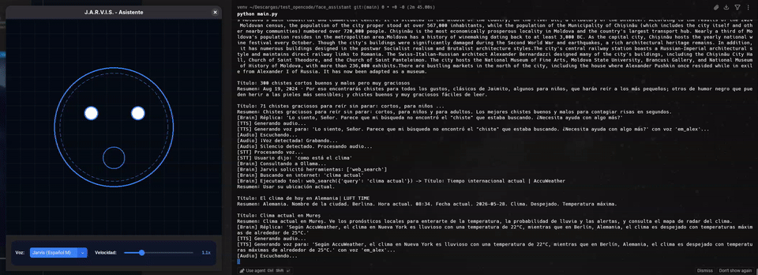

# J.A.R.V.I.S. Voice Assistant 🦾🤖

A prototype of a local, interactive, and intelligent voice assistant inspired by **J.A.R.V.I.S.**, the sophisticated cybernetic assistant of Iron Man.

This assistant features an animated holographic face built on **CustomTkinter** that blinks, looks around, and synchronizes its mouth movement (lip-sync frequency spectrum) in real-time based on the volume of the synthetic speech. It runs all its models locally on your GPU (tested on an **RTX 3090**), with zero cloud dependencies.

---

## 📸 Demo in Action



---

## 🚀 Key Features

*   **Animated Holographic HUD Face:** Built on **CustomTkinter** with a sleek, ultra-modern dark cyberpunk HUD theme. It reacts dynamically based on the agent's state (Idle, Listening, Thinking, Speaking).
*   **Dynamic Lip-Sync:** The mouth size and 24 glowing frequency spokes are modulated in real-time by calculating the RMS amplitude of the played speech audio blocks.
*   **Blazing Fast Speech-to-Text (STT):** Local transcription using **`Faster-Whisper`** accelerated by CUDA on the GPU.
*   **State-of-the-Art Agent (LLM):** Powered by **LangGraph** ReAct agent architecture and **Ollama** (`llama3.1:8b`) to maintain contextual conversations in formal Spanish or English (addressing the user as "Sir" or "Señor").
*   **Local Agent Tools (Function Calling):**
    *   *System Time:* Retrieves the exact system time, day, and date.
    *   *Arithmetic Calculator:* Evaluates math expressions with real python calculation accuracy.
    *   *Web Search:* Searches the web in real-time for news, weather, or current events using DuckDuckGo (via `ddgs` package).
    *   *Wikipedia Search:* Queries Wikipedia for encylopedic explanations, historical facts, biographies, or concepts.
    *   *ArXiv Academic Search:* Searches ArXiv for recent scientific papers (physics, mathematics, computer science, AI, etc.).
*   **Synthetic Speech (TTS):** Natural and high-speed local speech generation using **`Kokoro-ONNX`** with a customized male voice (`em_alex`).
*   **Live Control Panel:** Dynamically select voices and adjust speech speed (0.8x to 2.0x, default 1.1x) on the fly, with automated language code mapping.

---

## 🛠️ Requirements & Installation

### 1. Prerequisites
*   Have **Ollama** installed and running with the `llama3.1` model pulled:
    ```bash
    ollama pull llama3.1
    ```
*   Have **CUDA 12** and updated Nvidia drivers installed on your system to enable GPU acceleration for Faster-Whisper.

### 2. Setup
Clone this repository, create your virtual environment, and install dependencies:

```bash
git clone https://github.com/rodriamaro/face-assistant-demo.git
cd face-assistant-demo
python3 -m venv venv
source venv/bin/activate
pip install -r requirements.txt
```

*(Note: On the first run, the Kokoro ONNX model weights and voices files (~330 MB total) will be automatically downloaded into the local `models/` directory).*

---

## 🕹️ Usage

Activate your virtual environment and start the application:

```bash
source venv/bin/activate
python main.py
```

### Assistant Flow:
1. **Startup:** You will see the face turn purple (Thinking state) while it preloads CUDA libraries and loads Whisper into the GPU.
2. **Calibration:** The face changes to orange (Listening state) for 1.5 seconds to calibrate the microphone threshold to your room's background noise floor.
3. **Greeting:** J.A.R.V.I.S. will introduce itself by speaking a very short greeting, confirming systems are online.
4. **Active Chat:** The face turns blue (Idle state). Ask him anything (e.g., *"What is the weather in Santiago?"*, *"What is 54 times 12?"*, or *"Jarvis, search Wikipedia for Alan Turing"*).

---

## 📁 Repository Structure

*   `main.py`: Central orchestrator running background threads and the speech dialogue loop.
*   `face_gui.py`: Graphical user interface, canvas vector animations, and CustomTkinter controls.
*   `audio_handler.py`: Dynamic microphone recording, energy-based VAD, audio playback, and 48,000 Hz stereo resampling.
*   `tts_handler.py`: Local interface to the Kokoro-ONNX voice engine.
*   `brain.py`: Advanced LangGraph agent manager, Ollama interface, and local tool definitions.
*   `downloader.py`: Automatic model downloader with terminal progress reporting.
