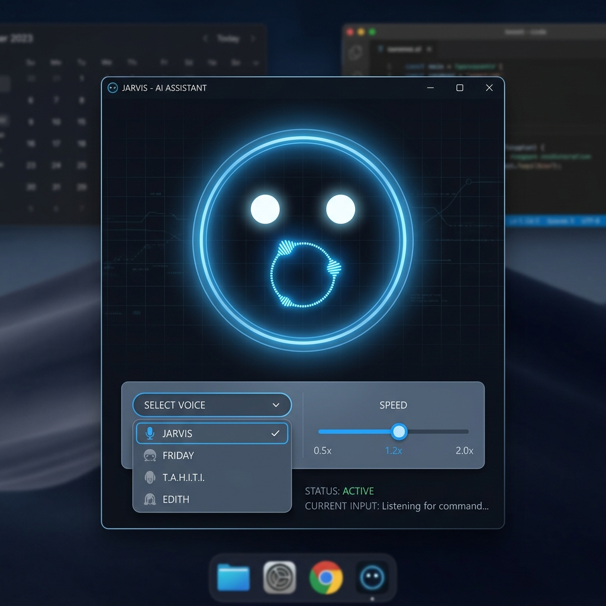

# J.A.R.V.I.S. Voice Assistant 🦾🤖

Un prototipo de asistente de voz local, interactivo e inteligente inspirado en **J.A.R.V.I.S.**, el sofisticado asistente cibernético de Iron Man.

Este asistente cuenta con un rostro minimalista y holográfico que parpadea, mira a su alrededor y sincroniza el movimiento de su boca (lip-sync) en tiempo real según la intensidad del habla. Ejecuta todos sus modelos locales gracias a tu GPU (probado en una **RTX 3090**), con cero dependencias en la nube.

---

## 📸 Captura de Pantalla



---

## 🚀 Características Principales

*   **Rostro Holográfico Animado:** Construido sobre **CustomTkinter** con un diseño oscuro ultra-moderno de tipo cyberpunk. Reacciona dinámicamente según el estado (En espera, Escuchando, Pensando, Hablando).
*   **Sincronización Labial Dinámica:** El tamaño de la boca se modula en tiempo real calculando la amplitud RMS de la reproducción de audio sintético.
*   **Oído Ultra Rápido (STT):** Transcripción local usando **`Faster-Whisper`** acelerada mediante CUDA en la GPU.
*   **Cerebro Inteligente Local (LLM):** Utiliza **Ollama** (`llama3.1:8b`) para mantener conversaciones contextuales en español formal (tratamiento de "Señor" o "Sir").
*   **Herramientas Locales (Function Calling / Agents):**
    *   *Hora del Sistema:* Consulta de fecha y hora exacta del sistema en tiempo real.
    *   *Calculadora Aritmética:* Resuelve operaciones aritméticas con exactitud matemática real.
    *   *Búsqueda en Internet (Web Search):* Realiza búsquedas de noticias o clima en internet en tiempo real mediante DuckDuckGo (paquete `ddgs`), permitiendo que el LLM responda con información al día.
*   **Voz en Español Sintética (TTS):** Generación de voz natural y veloz basada en **`Kokoro-ONNX`** utilizando una voz masculina adaptada (`em_alex`).
*   **Panel de Control en Vivo:** Slider para ajustar la velocidad de lectura (0.8x a 2.0x) y selector dinámico de voz que ajusta automáticamente los parámetros fonéticos en tiempo real.

---

## 🛠️ Requisitos e Instalación

### 1. Requisitos Previos
*   Tener **Ollama** instalado y corriendo con el modelo `llama3.1`:
    ```bash
    ollama pull llama3.1
    ```
*   Tener instalado **CUDA 12** y controladores de Nvidia actualizados para habilitar la velocidad del STT en la GPU.

### 2. Configuración del Entorno
Clona este repositorio, crea tu entorno virtual e instala las dependencias:

```bash
git clone https://github.com/rodriamaro/face-assistant-demo.git
cd face-assistant-demo
python3 -m venv venv
source venv/bin/activate
pip install -r requirements.txt
```

*(Nota: En la primera ejecución se descargarán automáticamente los pesos del modelo Kokoro TTS y voices en una carpeta local `models/` de unos 330 MB totales).*

---

## 🕹️ Cómo Ejecutar

Activa tu entorno virtual y arranca la aplicación:

```bash
source venv/bin/activate
python main.py
```

### Flujo del Asistente:
1. **Inicio:** Verás el rostro en color morado (Pensando) mientras carga Whisper en la GPU.
2. **Calibración:** La cara cambia a naranja (Escuchando) durante 1.5 segundos para ajustar el micrófono según el ruido de fondo.
3. **Bienvenida:** J.A.R.V.I.S. se presentará de forma muy corta por voz informando el estado de sus sistemas.
4. **Charla Activa:** La pantalla se tornará azul (En espera). Hazle cualquier pregunta (ej. *"¿Qué clima hace en Santiago?", "¿Cuánto es 54 por 12?"* o *"Jarvis, ¿cuáles son las últimas noticias de tecnología?"*).

---

## 📁 Estructura de Código

*   `main.py`: Orquestador principal que maneja los hilos de ejecución en segundo plano y el flujo conversacional.
*   `face_gui.py`: Renderizador gráfico del rostro y controles usando CustomTkinter.
*   `audio_handler.py`: Modulación del audio, grabación, calibración del ruido de fondo VAD y resampleado a 48,000 Hz estéreo.
*   `tts_handler.py`: Interfaz local con el motor Kokoro-ONNX.
*   `brain.py`: Interfaz de agente con Ollama y definiciones de herramientas locales.
*   `downloader.py`: Descarga y validación automática de los modelos.
